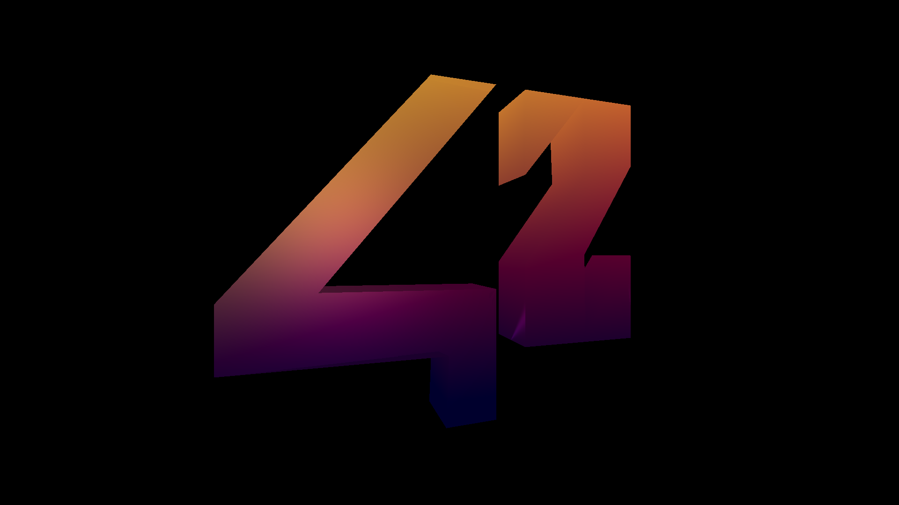
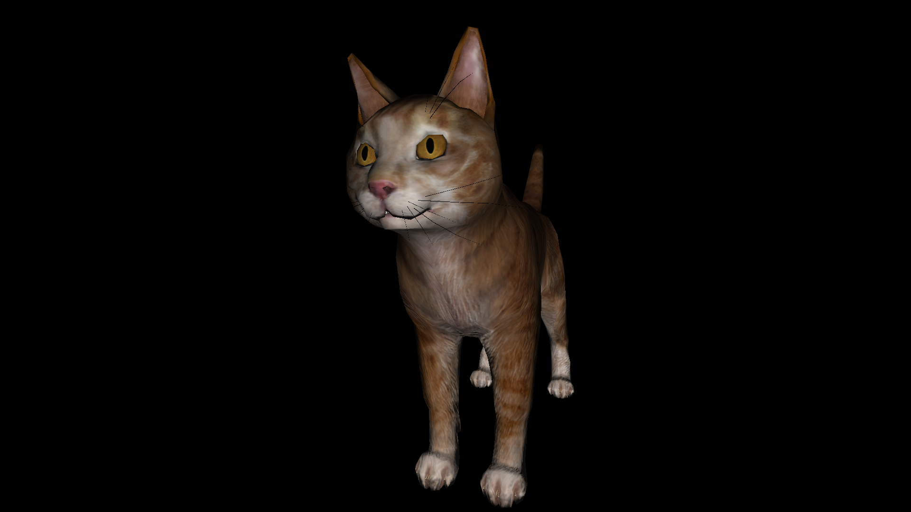
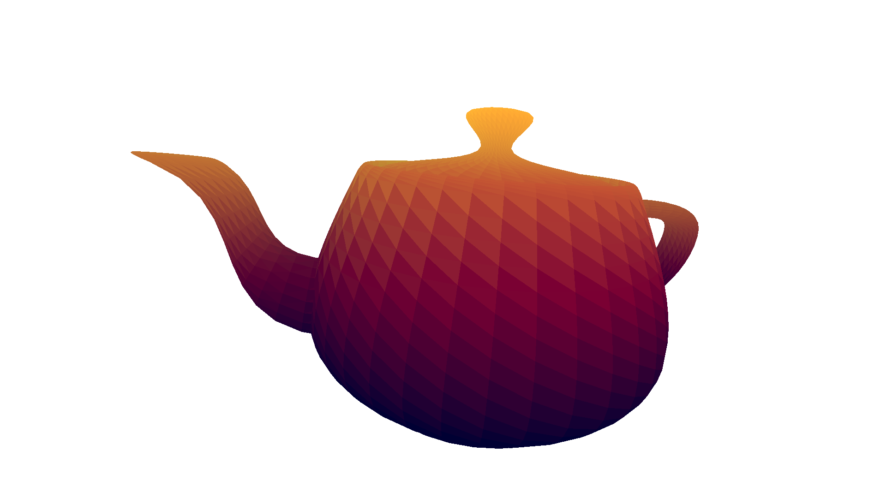
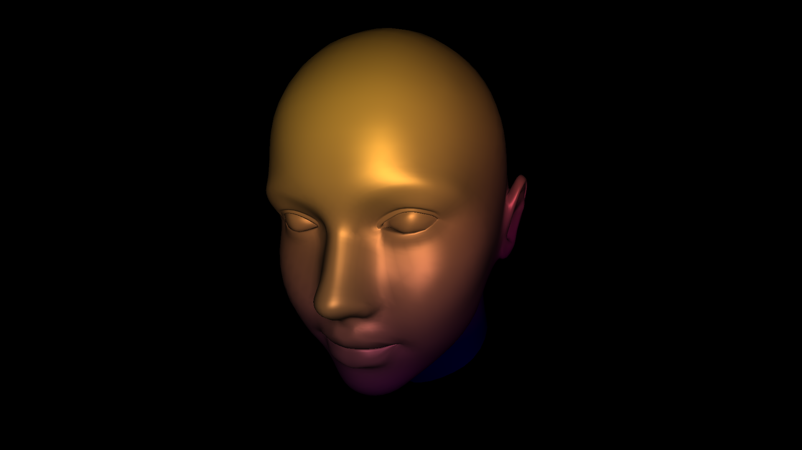
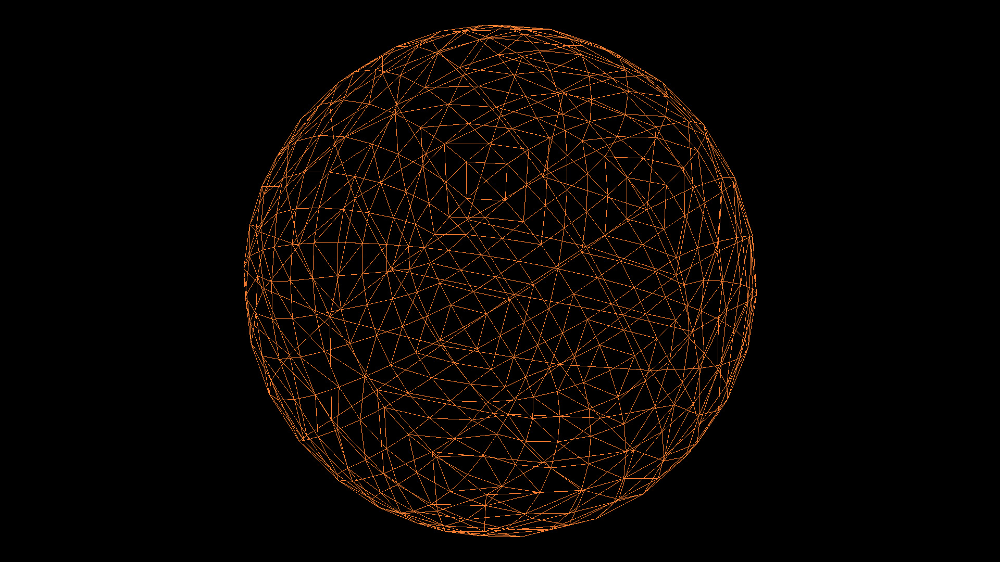

# Scop - 42/Unit Factory

Browser for 3D models on openGL with its own algorithm for loading OBJ geometry format.

# Authors:
- vholovin

# Features:
- SDL framework + OpenGL
- STB for upload textures
- auto downloader and auto installer for libraries with Makefile's command "make"

# This project work only MacOS system
- Use "make" to compile program in terminal
- run "./scop [filename].obj [diffuse_texture] [normal_texture]"

# Program features:
- moving and rotating system for model
- calculates normals if vectors of normal in a file are not found
- read texture UV cord for diffusion and normal mapping
- light effect
- regulate specular effect

# Controls:
'`esc`' - exit

# Move model:
- axis X+:		'`right`'
- axis X-:		'`left`'
- axis Y+:		'`up`'
- axis Y-:		'`down`'
- axis Z+:		'`<`'
- axis Z-:		'`>`'

# Rotate model:
press key '`shift`' and any keys:
- axis X+:		'`right`'
- axis X-:		'`left`'
- axis Y+:		'`up`'
- axis Y-:		'`down`'
- axis Z+:		'`<`'
- axis Z-:		'`>`'

# Scale model:
- up scale:		'`+`'
- down scale:	'`-`'

# Background color:
- color:		'`b`'

# Effects:
- diffuse:		'`d`'
- normal:		'`n`'
- specular:		'`s`'

# Specular index:
- up index:		'`a`'
- down index:	'`z`'

# Color mods:
- '`1`' : wire
- '`2`' : B&W triangle gradient
- '`3`' : color triangle gradient
- '`4`' : color + normal mapping + light effect
- '`5`' : diffuse mapping + normal mapping + light effect
